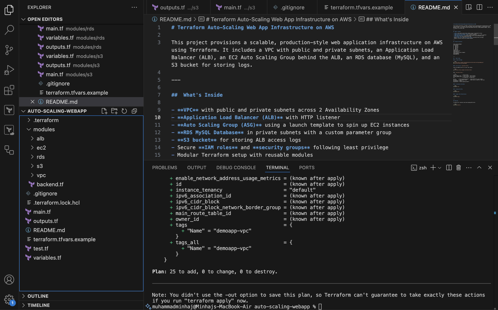

# Terraform Auto-Scaling Web App Infrastructure on AWS

This project provisions a scalable, production-style web application infrastructure on AWS using Terraform. It includes a VPC with public and private subnets, an Application Load Balancer (ALB), an EC2 Auto Scaling Group behind the ALB, an RDS database (MySQL), and an S3 bucket for storing logs.

---

##  What's Inside

- **VPC** with public and private subnets across 2 Availability Zones
- **Application Load Balancer (ALB)** with HTTP listener
- **Auto Scaling Group (ASG)** using a launch template to spin up EC2 instances
- **RDS MySQL Database** in private subnets with a custom parameter group
- **S3 bucket** for storing ALB access logs
- Secure **IAM roles** and **security groups** following least privilege
- Modular Terraform setup with reusable modules

---

##  Project Structure

```
auto-scaling-webapp/
├── modules/
│   ├── alb/
│   ├── ec2/
│   ├── rds/
│   ├── s3/
│   └── vpc/
├── main.tf
├── variables.tf
├── outputs.tf
├── terraform.tfvars.example
├── .gitignore
└── README.md
```

---

## 🚀 How to Use

### 1. Clone the Repo

```bash
git clone https://github.com/minhajlhq/terraform-auto-scaling-webapp.git
cd terraform-auto-scaling-webapp
```

### 2. Set up your `terraform.tfvars`

Copy the example and fill in your real values:

```bash
cp terraform.tfvars.example terraform.tfvars
```

Edit `terraform.tfvars`:

```hcl
vpc_cidr             = "10.0.0.0/16"
public_subnet_cidrs  = ["10.0.1.0/24", "10.0.2.0/24"]
private_subnet_cidrs = ["10.0.3.0/24", "10.0.4.0/24"]
azs                  = ["us-east-1a", "us-east-1b"]

ami_id      = "ami-xxxxxxxxxxxxxxxxx"   # Valid AMI ID for your region
key_name    = "your-keypair-name"       # Must exist in AWS EC2 > Key Pairs
db_username = "admin"
db_password = "YourStrongPassword123!"
```

### 3. Initialize Terraform

```bash
terraform init
```

### 4. Review the Plan

```bash
terraform plan
```

### 5. Apply the Infrastructure

```bash
terraform apply
```

---

## Clean Up

To destroy all resources and avoid ongoing AWS costs:

```bash
terraform destroy
```


